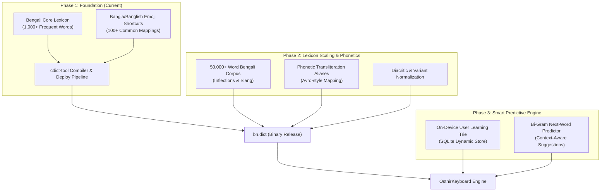

# Strategic Planning & Roadmap (`PLANNING.md`)

This document outlines the multi-phase engineering plan for building, scaling, and optimizing the **Bengali dictionary engine, emoji intelligence, and predictive typing systems** for OsthirKeyboard.

---

## Architecture Blueprint

---

## Development Phases & Milestones

### Phase 1: Core Foundation & Emoji System (Target: Immediate / In Progress)
- [x] Set up dedicated developer workspace (`E:\Development\AndroidApp\bn.dict\`).
- [x] Create foundational `bangla_words.combined` with top high-frequency words.
- [x] Create comprehensive `bangla_emojis.combined` with multi-keyword mappings (`love`, `valobasa`, `ভালবাসা` $\to$ ❤️).
- [x] Automated build and deployment pipeline (`build.py`, `build.ps1`).

---

### Phase 2: Lexicon Scaling & Phonetic Expansion (Target: Milestone 2)
**Goal:** Expand vocabulary from core words to over 50,000 words covering daily texting, formal writing, and modern digital slang.

#### Objectives:
1. **Corpus Extraction**:
   - Ingest open-source Bengali corpora (Bengali Wikipedia dumps, Ankur Bangla lexicon, OpenBoard wordlists).
   - Filter out spelling mistakes and normalize archaic Unicode zero-width characters (`ZWNJ` / `ZWJ`).
2. **Frequency Calibration**:
   - Calibrate word frequencies using Zipf's Law distribution across 1–255 bins.
3. **Phonetic Aliases**:
   - Embed common phonetic Banglish spelling variations into the dictionary aliases so phonetic typing produces clean autocomplete predictions.

---

### Phase 3: Bi-Gram Transition Modeling & Next-Word Prediction (Target: Milestone 3)
**Goal:** Enable next-word suggestions in `CandidatesView` when spacebar is pressed ($P(W_n \mid W_{n-1})$).

#### Objectives:
1. **Bi-Gram Extraction Pipeline**:
   - Process Bengali sentence datasets to generate pairwise transition probabilities:
     - `আমি` $\to$ `তোমাকে` (f=250)
     - `কেমন` $\to$ `আছো` (f=255)
     - `শুভ` $\to$ `সকাল` (f=245)
     - `অনেক` $\to$ `ধন্যবাদ` (f=240)
2. **Compact Binary Transition Format**:
   - Export top 20,000 bi-gram pairs into a compact binary table loaded by `NextWordPredictor.java`.

---

### Phase 4: On-Device User Learning & Privacy-First Personalization (Target: Milestone 4)
**Goal:** Dynamically adapt to the user's specific vocabulary, names, phone numbers, and slang without compromising privacy.

#### Objectives:
1. **SQLite Dynamic Prefix Store**:
   - Maintain an encrypted / device-protected database (`UserDictionary.db`).
   - Dynamically bump frequency when a user selects a word repeatedly.
2. **Priority Merging Engine**:
   - Priority 1: User personal words / custom names.
   - Priority 2: Bi-gram next-word predictions.
   - Priority 3: Static `bn.dict` prefix matches.
   - Priority 4: Emoji trigger matches.

---

## Risk Management & Performance Targets

| Metric | Target | Verification Method |
| :--- | :--- | :--- |
| **`bn.dict` Binary Size** | $< 1.5\text{ MB}$ | Ensure fast cold start and low APK size. |
| **Query Latency** | $< 0.5\text{ ms}$ | `libcdict` native C trie benchmark per keystroke. |
| **Memory Consumption** | $< 8\text{ MB}$ RAM | Memory footprint inside `Dictionaries.java`. |
| **Direct Boot Safety** | $100\%$ Crash-Free | Verified with locked boot PIN screen. |
